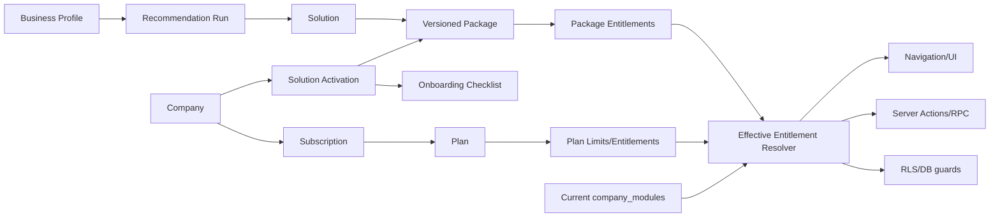

# PROCESA Cloud — Solution Packages & Entitlements

**Estado:** propuesta de arquitectura; no implementada.

**Restricción:** este documento no autoriza cambios de schema, migraciones, RLS ni billing.

## 1. Problema

El modelo actual conoce `plans`, `subscriptions`, `modules` y `company_modules`. Es suficiente para limitar usuarios/sucursales y habilitar módulos, pero no expresa qué compra el cliente ni por qué. “PROCESA POS para minimarket” es una solución comercial; `pos`, `core` y permisos son capacidades técnicas.

La capa propuesta debe traducir intención comercial a entitlements sin duplicar la implementación de cada vertical.

## 2. Taxonomía

| Concepto | Significado | Ejemplo |
|---|---|---|
| Core | Servicios comunes obligatorios | Auth, tenant, empresa, sucursales, RBAC, auditoría |
| Solution | Resultado/producto que el cliente reconoce | PROCESA POS, PROCESA REST |
| Capability | Unidad funcional habilitable | terminal, inventario, compras, reportes |
| Package | Composición versionada de capabilities | POS Starter, POS Pro |
| Plan | Capacidad comercial transversal | Free, Pro, Business |
| Entitlement | Derecho efectivo calculado | `pos.terminal.use`, 5 sucursales |
| Add-on | Capacidad opcional compatible | DOCS, CPE avanzado, soporte premium |
| Subscription | Contrato vigente de una empresa con plan/periodo | Trial Pro por 14 días |
| Activation | Elección de solución/paquete para una empresa | POS Starter activo |

No se debe crear una “app nueva” por sector cuando la diferencia pueda expresarse como configuración, capability o extensión. Las verticales comparten Core y servicios transversales.

## 3. Entidades conceptuales propuestas

Los nombres siguientes son **PROPOSED** y no existen necesariamente en la base actual.

| Entidad propuesta | Propósito | Campos mínimos conceptuales |
|---|---|---|
| `solution_catalog` | Catálogo comercial | code, name, category, lifecycle_status, description |
| `solution_packages` | Oferta versionada por solución | solution, code, version, name, active_from/to |
| `package_entitlements` | Capacidades y límites incluidos | package, entitlement_key, value, mode |
| `company_solution_activations` | Qué solución/paquete usa el tenant | company, package_version, status, activated_at |
| `business_profiles` | Discovery aprobado por empresa | industry_code, size_band, needs, source |
| `recommendation_runs` | Explicación/reproducibilidad | input snapshot, ruleset_version, ranked results |
| `onboarding_checklists` | Plantilla versionada | solution/package/version, required items |
| `company_onboarding_progress` | Progreso por activación | activation, item, status, evidence, updated_at |

Antes de implementar, debe decidirse si algunas entidades pueden vivir en JSONB/catalog configuration. Para auditoría, billing y cambios de versión conviene persistir activación y snapshot de entitlement, no depender solo del catálogo mutable.

## 4. Relaciones



## 5. Cálculo de entitlement efectivo

Orden recomendado:

1. Empresa y suscripción deben ser operables.
2. La solución debe estar activa y su paquete vigente.
3. El plan define límites máximos y capabilities permitidas.
4. El paquete define el conjunto inicial de capabilities.
5. Add-ons aprobados pueden ampliar ese conjunto.
6. Overrides de plataforma solo pueden ser explícitos, temporales y auditados.
7. El resultado se intersecta con lifecycle/status de módulos.
8. El usuario todavía necesita rol, permiso y scope de sucursal.

```text
can(user, action, resource) =
  authenticated
  AND active_membership(company)
  AND allowed_branch_scope(resource.branch)
  AND company_operable
  AND effective_entitlement(capability)
  AND effective_permission(action)
  AND RLS/RPC invariant
```

La navegación nunca es control de seguridad. Ocultar una opción mejora UX; backend y RLS deben repetir la decisión.

## 6. Reglas para no duplicar verticales

- POS, REST, GYM o VET dependen de Core; Core nunca depende de una vertical.
- Inventario, CPE, documentos, pagos o auditoría son servicios compartidos cuando el dominio sea común.
- Las diferencias por sector se expresan con configuración/esquema de extensión, no copiando tablas completas.
- Una capability tiene una clave estable; el nombre comercial puede cambiar sin romper permisos.
- Un paquete es versionado e inmutable una vez vendido; una nueva oferta crea versión.
- El tenant conserva un snapshot contractual para explicar qué se habilitó.
- No activar módulos “por ser el primero del query”; toda composición es explícita y determinística.

## 7. Catálogo inicial conceptual

| Solución | Estado comercial | Package V1 sugerido | Capabilities iniciales | Dependencias |
|---|---|---|---|---|
| PROCESA POS | Prioridad P1 / piloto | POS Starter | productos, categorías, almacén, caja, terminal, ventas, inventario básico, reportes base | Core + sucursal + permisos POS |
| PROCESA POS | Futuro | POS Growth | Starter + compras, transferencias, devoluciones, reportes avanzados, CPE según readiness | POS Starter |
| PROCESA REST | Roadmap | No vender aún | No crear paquete activable | Core; implementación futura |
| PROCESA CONTA | Roadmap | No vender aún | No crear paquete activable | Core; implementación futura |
| PROCESA DOCS | Planificado | Add-on futuro | storage/document lifecycle | Core + storage |
| Viernes | Evolución | No entitlement comercial aún | asistencia contextual futura | Política IA, permisos y auditoría |

“No vender aún” evita que el catálogo visual se convierta accidentalmente en compromiso contractual.

## 8. Recomendación V1

El motor V1 debe ser determinístico, explicable y sin IA generativa:

| Señal | Regla | Resultado |
|---|---|---|
| Minimarket, bodega, tienda, ferretería o retail pequeño | Necesita ventas/caja/stock | Recomendar PROCESA POS Starter |
| Varias sedes o almacén central | Necesita consolidación/transferencias | Recomendar POS Growth cuando esté disponible; mientras tanto, demo asistida |
| Restaurante/cafetería/bar | Vertical no disponible | Mostrar PROCESA REST como roadmap y ofrecer demo/contacto; no activar POS por defecto |
| Solo contabilidad | Vertical no disponible | Mostrar CONTA como roadmap y asesoría |
| Necesidad documental transversal | Add-on no disponible | Registrar interés; no habilitar capability ficticia |
| “Otro” o combinación ambigua | Sin match confiable | Preguntar necesidad principal y ofrecer asesoría; permitir explorar catálogo |

Cada recomendación debe mostrar “por qué”, capacidades incluidas, restricciones y alternativas. El usuario puede cambiar la recomendación; el sistema registra aceptación o cambio, no fuerza una clasificación.

## 9. Plan, paquete y add-on

Plan y paquete no son sinónimos:

- El **plan** limita escala transversal (usuarios, sucursales, soporte, retención).
- El **paquete** define el resultado/capabilities de una solución.
- El **add-on** agrega una capability compatible.
- La **suscripción** materializa el acuerdo temporal y estado de cobro.

Ejemplo conceptual:

```text
Empresa Andina
  Subscription: Pro / active
  Activation: PROCESA POS / POS Starter v1
  Add-on: ninguno
  Effective: max_users=20, max_branches=5,
             core=true, pos.terminal=true, pos.inventory.basic=true
```

## 10. Lifecycle y estados

### Solution/package

`DRAFT → PILOT → AVAILABLE → DEPRECATED → RETIRED`

### Company activation

`PENDING → CONFIGURING → ACTIVE → SUSPENDED → DEACTIVATED`

### Checklist item

`NOT_STARTED → IN_PROGRESS → COMPLETED | SKIPPED | BLOCKED`

Solo `AVAILABLE` debe permitir autoservicio. `PILOT` requiere allowlist/asistencia. `ROADMAP` pertenece a contenido de marketing, no a entitlements ejecutables.

## 11. Seguridad y RLS: contrato futuro

- Toda fila tenant-bound lleva `company_id` o deriva inequívocamente de una entidad con `company_id`.
- Activaciones y snapshots contractuales son legibles por miembros autorizados; mutación tenant limitada y/o RPC.
- Cambios comerciales sensibles son Super Admin o flujo billing verificado, siempre auditados.
- Recomendaciones no conceden acceso.
- Activación visual no concede acceso hasta completar transacción backend.
- Overrides requieren motivo, actor, expiración y audit log.
- Acceso por sucursal necesita modelo explícito; no reutilizar únicamente la cookie de contexto.

## 12. Compatibilidad con el modelo actual

Ruta de transición conceptual:

1. Conservar `plans`, `subscriptions`, `modules` y `company_modules` como primitivas actuales.
2. Añadir, solo tras aprobación, catálogo comercial versionado.
3. Resolver paquetes a los module codes/capabilities actuales.
4. Introducir un único resolver de entitlement efectivo.
5. Migrar UI y acciones gradualmente detrás de feature flag.
6. No eliminar campos/tablas previos hasta tener backfill, comparación y rollback.

No se define aquí número de migración. En particular, **no se autoriza migration 072**.

## 13. Decisiones pendientes antes de implementar

1. ¿Una empresa puede activar varias soluciones simultáneamente en V1?
2. ¿El paquete se factura por empresa, sucursal, usuario o combinación?
3. ¿Qué capacidades POS están realmente disponibles para piloto comercial?
4. ¿Cómo se versionan precios e impuestos por país?
5. ¿Qué lectura conserva un tenant suspendido?
6. ¿Quién puede cambiar paquete: owner, billing admin o solo PROCESA?
7. ¿Cuál es el modelo exacto de scopes por sucursal?
8. ¿Qué tabla de onboarding será canónica?

Hasta resolver estas decisiones, la arquitectura permanece como propuesta documental.
# Implementation note — V1

La migración 072 propone catálogo versionado, paquetes y activaciones multi-solución. `getEffectiveEntitlements` es la nueva fachada de lectura; `plans`, `subscriptions`, `modules` y `company_modules` continúan siendo los mecanismos técnicos existentes.
