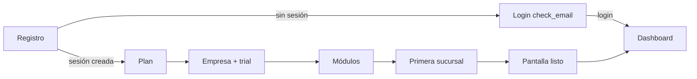
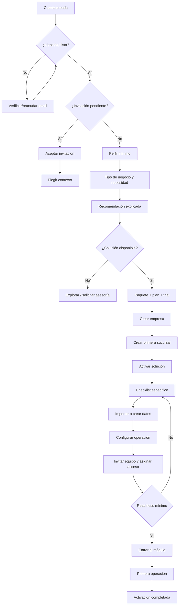

# PROCESA Cloud — Onboarding Flow

**Estado:** diseño propuesto sobre auditoría del flujo existente.

**Implementación:** no realizada en esta etapa.

## 1. Flujo actual



Pasos persistidos hoy en `onboarding_states`: `plan`, `company`, `modules`, `branch`, `complete`. Existe además `user_onboarding_states`, no integrado al flujo de rutas. El login directo no consulta ninguno de ambos.

## 2. Problemas del flujo actual

- El usuario elige plan y módulos antes de que el sistema entienda su negocio.
- No existe recomendación ni paquete de solución.
- “Listo” significa Core creado, no operación POS lista.
- Un abandono después del registro puede terminar en dashboard vacío.
- No hay importación, checklist ni primera operación guiada.
- La selección predeterminada del primer módulo depende del orden del catálogo.
- No se distinguen pasos obligatorios, opcionales y bloqueados.
- La duplicidad `onboarding_states` / `user_onboarding_states` impide una fuente única.

## 3. Flujo objetivo propuesto



## 4. Pantallas y contratos propuestos

| Paso | Pantalla | Datos/acción | Criterio de avance | Recuperación |
|---:|---|---|---|---|
| 0 | Resolución de entrada | user, email, invitación, onboarding, empresas | Destino único calculado server-side | Nunca perder `next` validado |
| 1 | Identidad | estado de email | Política productiva satisfecha | Reenvío limitado y enlace expirado claro |
| 2 | Perfil mínimo | nombre; opcional cargo/teléfono según decisión | Nombre válido | Editar después en settings |
| 3 | Tu negocio | sector, tamaño, sedes, necesidad, “Otro” | Respuestas mínimas | Guardar borrador |
| 4 | Recomendación | ranking y explicación | Aceptar o elegir alternativa | Solicitar asesoría si no hay match |
| 5 | Oferta | solución, paquete, plan, trial y términos | Resumen confirmado | Volver sin perder discovery |
| 6 | Empresa | datos comerciales/fiscales | Tenant creado idempotentemente | Reanudar tenant creado |
| 7 | Sucursal | nombre, código y mínimos | Sede creada y autorizada | Reusar sede si el retry ya la creó |
| 8 | Activación | paquete → entitlements | Activación backend confirmada | Estado BLOCKED con causa comercial |
| 9 | Checklist | items por solución | Mínimos completos | Progreso por item |
| 10 | Datos | crear/importar productos/clientes | Validación y commit explícito | Dry-run y archivo de errores |
| 11 | Operación | almacén, caja, impuestos/CPE | Readiness POS | Ayuda contextual |
| 12 | Equipo | invitaciones, roles, sucursales | Opcional para negocio unipersonal | Reenvío y estado de entrega |
| 13 | Go live | resumen y prueba | Primera operación válida | Volver al item fallido |
| 14 | Activado | dashboard con next best action | Evento de activación | Checklist accesible siempre |

## 5. Resolución del primer acceso

Pseudocontrato propuesto:

```text
if !authenticated:
  /login?next=<safe-relative-path>
else if pending_invitation:
  /aceptar-invitacion
else if email_confirmation_required && !confirmed:
  /verificar-correo
else if canonical_onboarding.status != COMPLETED:
  /onboarding/<canonical-step>
else if companies.length == 0:
  /onboarding/business
else if no_valid_active_context:
  /app/context
else:
  /app/dashboard
```

El destino debe calcularse en servidor. Solo se aceptan rutas relativas allowlisted para `next`; nunca URLs externas arbitrarias.

## 6. Estado canónico

Antes de implementar se debe elegir una de las tablas existentes como canónica y retirar gradualmente la otra. El contrato recomendado, independientemente del storage final, es:

```ts
type OnboardingStatus = "NOT_STARTED" | "IN_PROGRESS" | "COMPLETED" | "BLOCKED";
type OnboardingStep =
  | "identity"
  | "profile"
  | "business"
  | "recommendation"
  | "offer"
  | "company"
  | "branch"
  | "activation"
  | "solution_setup"
  | "team"
  | "go_live"
  | "complete";
```

Propiedades requeridas:

- una fila canónica por usuario/flujo;
- versión del workflow;
- empresa/activación asociada cuando exista;
- paso actual y último completado;
- metadata estrictamente validada;
- timestamps y causa de bloqueo;
- idempotency key para mutaciones creadoras;
- eventos de transición auditables.

No guardar secretos, tokens de invitación ni datos de pago en metadata.

## 7. Checklist POS V1 propuesto

| Item | Requerido para abrir terminal | Evidencia actual reutilizable |
|---|---:|---|
| Empresa creada | Sí | `companies`, membership owner |
| Sucursal activa | Sí | `branches` |
| Módulo POS habilitado | Sí | `company_modules`, entitlement |
| Almacén principal | Sí | Pantalla/tabla de warehouses |
| Caja registradora | Sí | `/app/pos/cash-registers` |
| Categoría y producto/servicio | Sí para venta real | `/app/pos/categories`, `/products` |
| Impuestos/documento interno | Sí según modo | Configuración POS/CPE a validar |
| Facturación electrónica | No para piloto interno; sí para emisión fiscal | Fundación CPE existente, readiness independiente |
| Clientes/proveedores | Opcional | Pantallas existentes |
| Inventario inicial | Opcional por tipo de producto | Ajuste inicial o importación futura |
| Invitación de cajero | Opcional | `/app/users` |
| Rol y scope de sucursal | Requerido si hay equipo | RBAC existe; scope por sucursal falta |
| Venta de prueba | Sí para declarar activación | Terminal/RPC de venta |

La terminal no debería bloquearse por elementos opcionales. Debe explicar exactamente qué falta y enlazar a la pantalla existente.

## 8. Diseño de “Otro / no estoy seguro”

Cuando el negocio no encaje:

1. Capturar descripción corta y necesidad principal.
2. Mostrar solo soluciones disponibles relevantes; no forzar un vertical incorrecto.
3. Ofrecer “Explorar PROCESA POS”, “Solicitar demo” o “Hablar con un especialista”.
4. Mantener el usuario y borrador; no crear automáticamente empresa/trial si no confirmó una oferta.
5. Registrar la demanda como señal de producto, no como entitlement.

## 9. Roles y acceso en onboarding

- El creador se convierte en owner/admin mediante el RPC actual.
- Un negocio de una sola persona puede omitir invitaciones.
- Para equipos, ofrecer plantillas de rol (Administrador, Supervisor, Cajero, Consulta) sin ocultar permisos efectivos.
- La selección de sucursal debe depender de un scope persistido y validado, aún no existente.
- Debe ser imposible suspender/retirar al último administrador; la protección actual se conserva.
- Invitación creada y email entregado son estados diferentes.

## 10. Estados visuales requeridos

Cada paso necesita:

- loading con layout estable;
- empty con una sola acción primaria;
- validación inline y resumen accesible;
- error recuperable con retry idempotente;
- error bloqueante con causa y soporte;
- success que confirme qué se creó;
- progreso real, no decorativo;
- guardado/reanudación explícitos;
- desktop y mobile;
- dark/light con tokens comunes.

El preview actual de onboarding presenta pérdida grave de estilos y contraste; no puede usarse como aceptación visual.

## 11. Seguridad y datos

- Toda creación de empresa/sucursal/activación debe validar Auth, membresía, plan y permisos en servidor/RPC.
- Query strings transportan identificadores, no autoridad.
- La sucursal seleccionada se revalida contra empresa y scope efectivo.
- Los reintentos no duplican empresa, trial, activación, sucursal ni importación.
- Las transiciones sensibles generan auditoría.
- Los errores no exponen existencia de cuentas, SQL ni configuración del proveedor.
- Importaciones futuras usan validación, límites, cuarentena lógica y procesamiento por lotes.

## 12. Instrumentación conceptual

Eventos mínimos, sin implementarlos ahora:

```text
signup_started, signup_completed, email_confirmation_sent,
email_confirmed, onboarding_resumed, business_profile_completed,
recommendation_viewed, recommendation_changed, offer_confirmed,
company_created, branch_created, solution_activated,
checklist_item_completed, invite_sent, invite_accepted,
pos_ready, first_cash_session_opened, first_sale_completed,
trial_expiring, conversion_requested, subscription_activated
```

Cada evento debe usar IDs internos, versión del flujo y timestamp; no incluir secretos ni payloads innecesarios.

## 13. Criterios de aceptación para una futura implementación

1. Usuario nuevo nunca aterriza en dashboard vacío por falta de routing.
2. Reanudar funciona desde cualquier paso y dispositivo.
3. Reintentos no duplican entidades.
4. Recomendación explica razones y permite alternativa.
5. Solo soluciones disponibles se activan.
6. Entitlements coinciden en UI, backend y RLS/RPC.
7. POS declara readiness con evidencia real.
8. Invitaciones distinguen creación, entrega, aceptación, expiración y revocación.
9. Scope por sucursal se aplica realmente, no solo visualmente.
10. Matriz visual pasa desktop/mobile y dark/light sin contrastes rotos.

## 14. Gate

Este diseño debe revisarse junto con `SOLUTION_PACKAGES_AND_ENTITLEMENTS.md`. Hasta aprobar fuente canónica, taxonomía, scopes y política de email, **no se debe implementar ni crear migration 072**.
