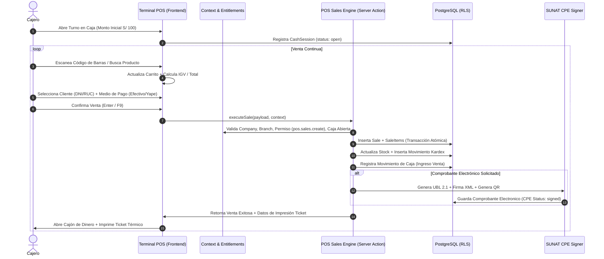

# PROCESA POS — BLUEPRINT FUNCIONAL Y TÉCNICO MAESTRO

============================================================
1. PERFIL DE PRODUCTO Y PÚBLICO OBJETIVO
============================================================
- **Nombre:** PROCESA POS
- **Vertical:** Retail Minorista, Bodegas, Minimarkets, Tiendas de Conveniencia, Ferreterías, Tiendas de Moda.
- **Enfoque de Experiencia (UX):** Alta velocidad operativa, optimización para lector de código de barras, soporte de teclado (atajos `F1-F12`, `Enter`, `ESC`), densidad visual balanceada y cero fricción en caja.
- **Arquitectura Base:** Integrado al Core SaaS (`company_id`, `branch_id`, RBAC, Suscripciones, Auditoría).

---

============================================================
2. MAPA INTEGRAL DE MÓDULOS Y SUBMÓDULOS
============================================================

```
PROCESA POS
│
├── 1. TERMINAL PUNTO DE VENTA (POS OPERATIVO)
│   ├── Modo Rápido (Lector de Código de Barras / Búsqueda Instantánea)
│   ├── Carrito Reactivo (Cantidades, Descuentos por ítem, Descuento Global)
│   ├── Selección / Creación Rápida de Cliente (DNI, RUC, Cliente Varios)
│   ├── Cobro Múltiple (Efectivo con cálculo de vuelto, Yape/Plin, Tarjeta, Mixto)
│   ├── Emisión Inmediata de Comprobante (Ticket, Boleta B001, Factura F001, Nota de Venta)
│   └── Venta en Espera (Pausar carrito y atender siguiente cliente)
│
├── 2. GESTIÓN DE CAJA Y TURNOS
│   ├── Apertura de Caja (Selección de caja física + Monto inicial de apertura)
│   ├── Movimientos de Caja (Ingresos manuales / Egresos / Gastos menores / Retiro de efectivo)
│   ├── Arqueo Ciego (Conteo de efectivo sin mostrar el sistema antes de cuadrar)
│   └── Cierre de Turno (Cálculo de sobrante/faltante, resumen de ventas y reporte Z impreso)
│
├── 3. CATÁLOGO Y PRODUCTOS
│   ├── Productos (Código SKU, Código de barras EAN-13, Nombre, Precio de Venta, Costo, IGV)
│   ├── Categorías y Marcas
│   ├── Unidades de Medida (Unidad, Kilo, Litro, Paquete, Caja - Catálogo 03 SUNAT)
│   ├── Promociones y Precios Especiales (Descuento por volumen, 2x1, Precio Mayorista)
│   └── Alertas de Stock Crítico
│
├── 4. INVENTARIO Y ALMACENES
│   ├── Control de Stock por Sucursal (`branch_id`)
│   ├── Kardex Físico y Valorizado (Costo Promedio Ponderado)
│   ├── Ajustes de Inventario (Entrada/Salida por merma, conteo físico, donación)
│   └── Transferencias entre Sucursales (Guía de remisión interna)
│
├── 5. COMPRAS Y PROVEEDORES
│   ├── Registro de Proveedores (RUC, Razón Social, Contacto)
│   ├── Registro de Compras (Facturas/Boletas de proveedor, actualización automática de stock y costo)
│   └── Historial de Compras y Cuentas por Pagar
│
├── 6. DEVOLUCIONES Y ANULACIONES
│   ├── Devolución Parcial o Total de Productos
│   ├── Reversión Automática a Inventario
│   ├── Emisión de Nota de Crédito Electrónica (SUNAT Tipo 07)
│   └── Devolución de Dinero en Caja
│
├── 7. FACTURACIÓN ELECTRÓNICA CPE (SUNAT)
│   ├── Configuración de Series (B001, F001, NC01, NV01)
│   ├── Generación UBL 2.1 y Firma Digital XMLDSig en background
│   ├── Consulta de Estado y Descarga de XML y CDR
│   └── Impresión Térmica de Ticket (80mm / 58mm) con Código QR Canónico
│
└── 8. REPORTES Y ANÁLISIS COMERCIAL
    ├── Reporte Diario de Ventas por Sucursal y Cajero
    ├── Ranking de Productos Más Vendidos (Pareto 80/20)
    ├── Reporte de Ganancias y Márgenes Brutos
    └── Libro de Ventas Formato SUNAT
```

---

============================================================
3. SECUENCIA OPERATIVA CRÍTICA (FLUJO DE VENTA EN VIVO)
============================================================



---

============================================================
4. MATRIZ DE PERMISOS GRANULARES PARA POS
============================================================
- `pos.terminal.access`: Acceso al terminal de punto de venta.
- `pos.sales.create`: Realizar ventas y cobros.
- `pos.sales.cancel`: Anular ventas emitidas.
- `pos.cash.open`: Abrir turno de caja.
- `pos.cash.movement`: Registrar ingresos y egresos extraordinarios.
- `pos.cash.close`: Realizar arqueo y cierre de caja.
- `pos.discounts.apply`: Aplicar descuentos manuales por encima del límite estándar.
- `pos.returns.manage`: Procesar devoluciones de mercadería.
- `pos.reports.view`: Consultar reportes analíticos de ventas y ganancias.
- `inventory.kardex.read`: Consultar kardex y valorización de inventario.
- `inventory.stock.adjust`: Realizar ajustes manuales de stock por merma.
